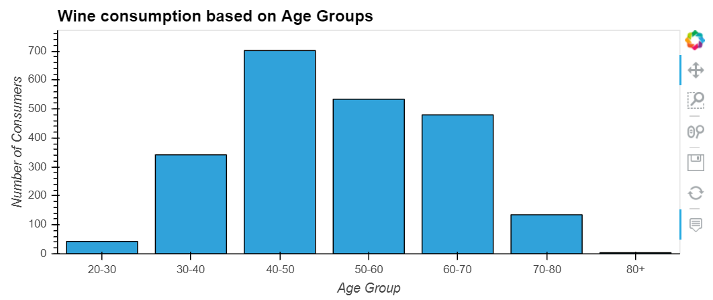
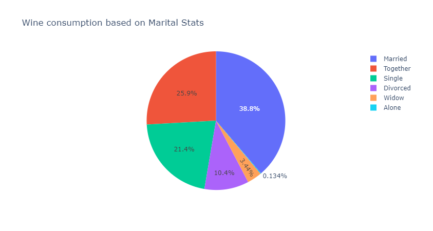
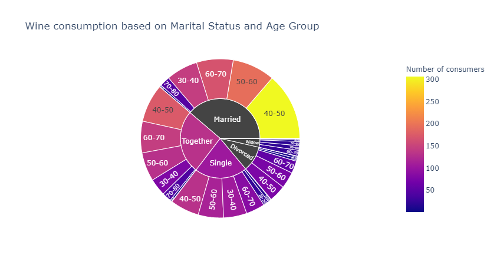

# Table of Contents
1. [Introduction- Project Win(e)list](#Introduction)
2. [Data, Technology and Coding standards](#Paragraph1)
   1. [Data sources](#SubParagraph1)
   2. [Technology stack](#Subparagraph2) 
   3. [Coding and Release standards](#Subparagraph3)
3. [Data cleanse and visualisation](#Paragraph2)
   1. [Data cleanse](#SubParagraph4)
   2. [Analysis- Customer segmentation](#SubParagraph5)
   3. [Analysis- Channel effectiveness](#Subparagraph6) 
   4. [Analysis- Campaign effectivenes](#Subparagraph7)
   5. [Key findings](#Subparagraph8)   
4. [Recommendations](#Paragraph3)
5. [References](#Paragraph4)

## Introduction- Project Win(e)list 

Winelist Corporation, a boutique wine company based in US, has requested an analysis of its customers and sales which will serve as input into their sales maximisation and marketing strategy. Data visulaisation tools have been used to present the findings and recommendations.

## Data, Technolgy and Coding standards 
### Data sources 

Winelist Corporation has provided the following data:
[Winelist Corporation](https://www.kaggle.com/c/winwinewine/data)

Additionallly, the American Census data has been sourced using API [American Census Data](https://www.forbes.com/advisor/banking/digit-budgeting-app-review/)

### Technology stack 

The following technologies have been used in developing this solution:
- Python libraries and code
- Pandas libraries including Census ???
- HVPlot
- Plotly
- Mapplot
- API
-
### Coding standards and release management 

Following rules must be applied during code development and testing:
1. All variables must reflect their purpose with uppercase letters to 
2. Each step of the code must contain comments to explain the purpose of the code and methodolgy
3. A git hub repository called Project1 will be set up with branches for each developer
4. Each developer must use their own git hub branch to code and unit test developed code
5. Lead developer must review code prior to merge
6. Lead developer is responsible for merging all code
7. Each developer must download the most recent code from main branch before commencing code changes
8. Each release must provide a brief message on changes made prior to committing the code

## Data cleanse and visualisation 
### Data cleanse 

The following data cleanse rules have been applied to the source data set:
1. Identified data set must be formatted correctly prior to use-Date format dd/mm/yyyy, age must be validated (not greater than 90 years), Amount must be integer with currency symbol as $
2. Redundant data, if any, must be dropped- drop columns XXXX and ‘Absurd’ marital status must be changed to the most frequent value for consistency.
3. Duplicates, if any must be dropped.
4. Ensure all columns have appropriate and correct headers.
5. Ensure records are sorted on the required fields.
6. Validate that entire data set has been correctly loaded.

### Analysis- Customer segmentation 

Age, education, marital status and income values from the cleansed data set have been used to analyse customers. Bar, Pie and Sunburst visualisation tools have been used to represent the data set. 

Below is the visual representation of the analysis:

### Analysis- Channel effectiveness 

### Analysis- Campaign effectivenes 

### Key findings 
1. Couples, either married or together, are the largest customer segment.
2. There is direct correlation between education and wine consumption- people who have completed basic education are not wine consumers.
3. There is a direct correlation between income and education which also leads to the conclusion that consumers who have higher incomes are wine consumers.

## Recommendations 

Based on the latest US census data and the identified target customer segment of couples who are educated, it is recommended that Winelist Corporation direct their marketing dollars to the below regions to maximise their sales. Based on the findings, 

## References 

1. [(https://digit.co/faq)]
3. [https://ptmoney.com/digit-review/]
4. [(https://www.forbes.com/advisor/banking/digit-budgeting-app-review/)]
5. [(https://techcrunch.com/2014/09/12/tink/)]
6. [(https://crunchbase.com/organization/digit-4/company_financials)]
7. [(https://Investorjunkie.com/reviews/digit/)]
8. [(https://mindk.com/blog/fintech-trends-2021/)]
9. [(https://golden.com/wiki/digit_company)]
10. [Tink(https://www.crunchbase.com/organization/tink)]
11. [Chime and Acorn(https://craft.co/digitco/competitors?competitors=digitco%2Cchime%2Cacorns%2Ccharlie-326)]
12. https://www.finance-monthly.com
13. [Betterment(https://www.forbes.com/sites/sarahhansen/2020/02/12/the-future-of-investing-fintech-50-2020/?sh=765dc8957ada)]